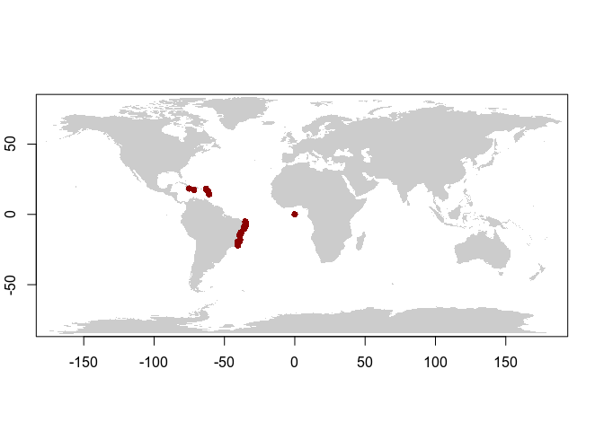

Microalgas e cianobactérias: abordagens e ferramentas para análises
taxonômicas, de diversidade e distribuição de espécies
================

## Período da disciplina

07/06/2021 a 16/06/2021

## Módulo sobre modelagem de nicho ecológico

Uso da modelagem de nicho como ferramenta para potencial de invasão,
indicação de possíveis novas áreas de ocorrência e impactos pelas
mudanças globais

### Cronograma

-   Segunda
    -   Manhã: Teórica
        -   Introdução à modelagem
        -   Conceito de nicho
        -   Premissas da modelagem
        -   Boas práticas
        -   Aquisição de ocorrências
        -   Limpeza de dados de ocorrências
        -   Aquisição de variaveis ambientais
        -   Seleção de dados ambientais
    -   Tarde: Prática
        -   Bases de dados de ocorrências ([GBIF](https://www.gbif.org/)
            e [speciesLink](http://www.splink.org.br/))
        -   Bases de dados de variáveis ambientais
            ([Bio-oracle](https://www.bio-oracle.org/) e
            [EarthEnv](http://www.earthenv.org/streams))
        -   Limpeza de dados de ocorrência
        -   Seleção de dados ambientais
-   Terça
    -   Manhã: Teórica
        -   Algoritmos
        -   Validação dos modelos
        -   Fluxo de trabalho (workflow)
        -   Estudos de caso (exemplos de uso para micro/macroalgas)
    -   Tarde: Prática
        -   Modelando as espécies
            -   Presente
            -   Futuro
-   Quarta
    -   Manhã: Prática
        -   Elaboração dos modelos e da apresentação
    -   Tarde: Apresentação dos trabalhos

### Links

-   [Ementa da
    disciplina](https://onedrive.live.com/view.aspx?resid=2A1CA0AB9CB1DE49!110482&ithint=file%2cdocx&authkey=!ABA9OVxmK7wRU0I)
-   [A Rapid Marine Biodiversity Assessment of the Abrolhos Bank, Bahia,
    Brazil](http://citeseerx.ist.psu.edu/viewdoc/download?doi=10.1.1.379.4381&rep=rep1&type=pdf)
-   [Native or introduced? A re-evaluation of Pyropia species
    (Bangiales, Rhodophyta) from Brazil based on molecular
    analyses](https://www.tandfonline.com/doi/full/10.1080/09670262.2014.982202)
-   

## Exemplos

Pontos de ocorrência da espécie *Dictyopteris jolyana*:

<!-- -->

Note that the `echo = FALSE` parameter was added to the code chunk to
prevent printing of the R code that generated the plot.
